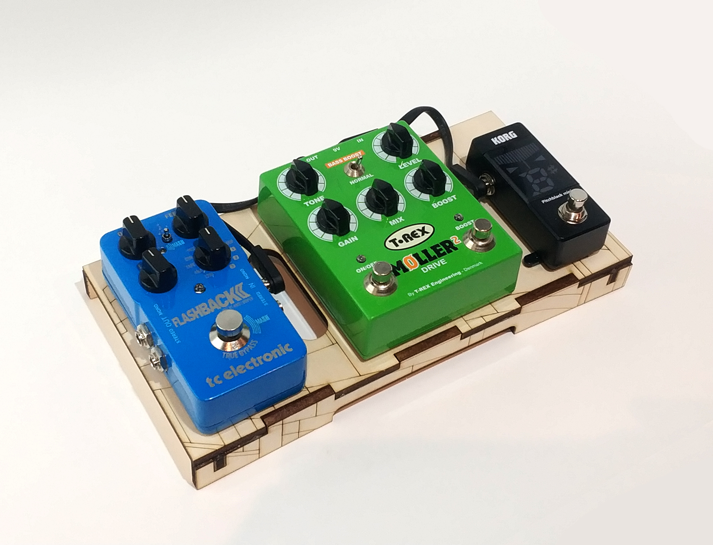

# LASERBOARD
A tiny pedalboard you can make at your local maker-space! You'll need some 6mm thick material, glue, common sense and a lasercutter.

Optional materials: Something to give it extra grip, Velcro and cable-ties.
